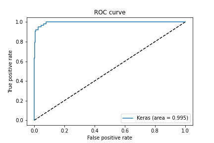
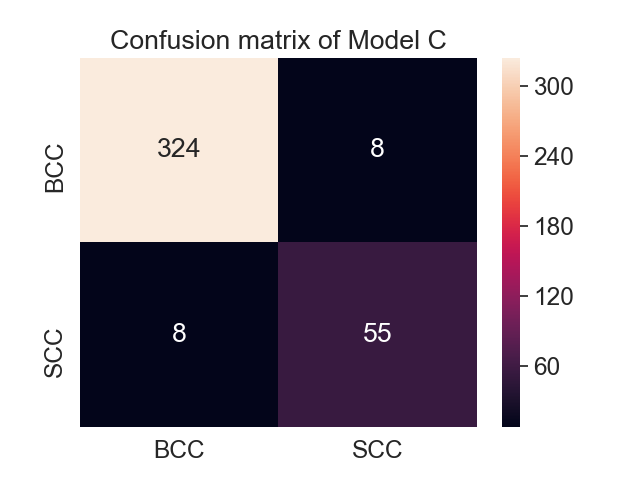
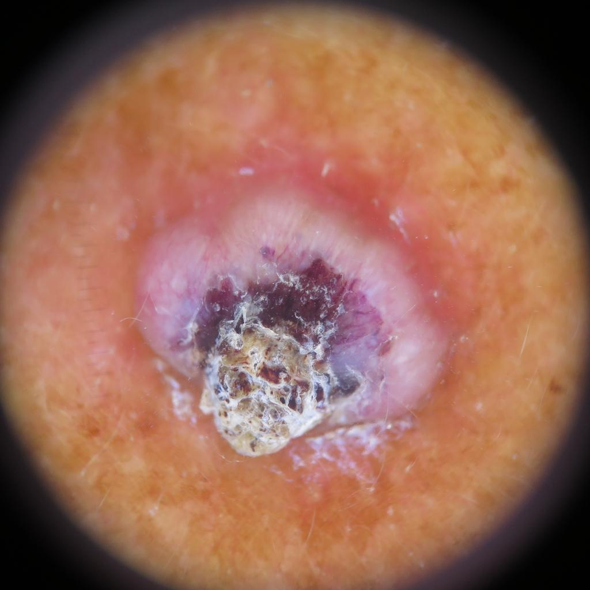
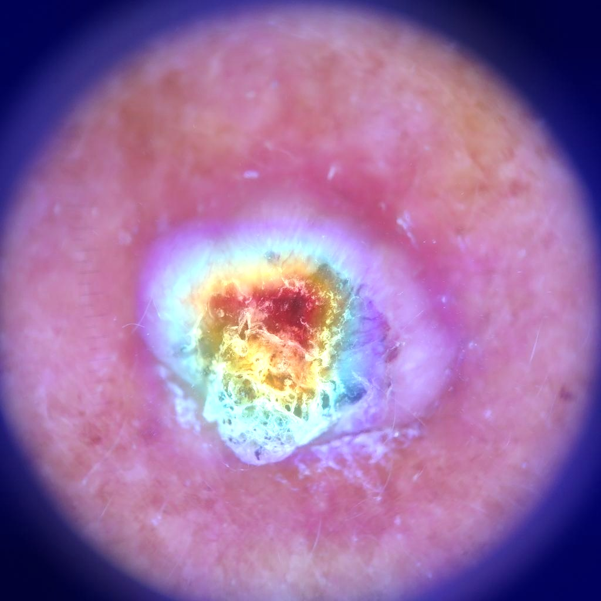

# Application of Deep Learning in the Classification of Basal Cell Carcinoma and Squamous Cell Carcinoma Skin Cancers

This repository contains the evaluation results, visual interpretability, and methodology overview for our research project on **automated classification of Basal Cell Carcinoma (BCC) and Squamous Cell Carcinoma (SCC)** using deep convolutional neural network (DCNN) architectures.

> ⚠️ **Note:** The full source code and model checkpoints are currently restricted as the accompanying research paper is under peer review. The complete implementation will be made publicly available upon formal publication.

---

## 📌 Abstract & Overview

Skin cancer is the most widespread type of cancer globally, with **Basal Cell Carcinoma (BCC)** and **Squamous Cell Carcinoma (SCC)** representing the most common non-melanoma skin cancer types. Accurate and timely diagnosis of these two lesions plays a vital role in effective treatment planning and improving patient survival rates.

While Deep Convolutional Neural Networks (DCNNs) offer powerful computer-aided diagnostic support using dermoscopic images, researchers face major hurdles due to **data scarcity** and severe **class imbalance** between BCC and SCC cases.

To overcome these challenges, this study proposes a robust deep learning framework incorporating **transfer learning, data augmentation, Focal Loss, class weight balancing, and a custom model-checkpoint monitoring criterion** designed specifically to address class imbalance.

---

## 🛠️ Methodological Highlights

* **Dataset:** Dermoscopic image dataset derived from **ISIC 2019**.
* **Evaluated Architectures:** Comparative investigation across multiple DCNN backbones:
  * **Xception** (Optimal Model)
  * **EfficientNetB0**
  * **EfficientNetB1**
  * **EfficientNetB2**
* **Overcoming Data Scarcity:** Transfer learning initialization combined with specialized dermoscopic data augmentation.
* **Class Imbalance Mitigation Strategies:**
  * **Focal Loss Function:** Reduces relative loss for well-classified examples and focuses on hard/rare cases.
  * **Data & Class Weighting:** Implemented a weighted sampling strategy favoring the minority class (**SCC**).
  * **Custom Criterion Monitoring:** Model checkpointing guided by customized validation metric monitoring to prevent minority class degradation.

---

## 📊 Experimental Results

Among all evaluated DCNN architectures, the fine-tuned **Xception** model integrated with the proposed loss and weighting formulations achieved superior classification performance:

| Metric | Performance (%) |
| :--- | :---: |
| **Accuracy** | **91.37%** |
| **Specificity** | **98.50%** |
| **Area Under Curve (AUC)** | **98.05%** |
| **F1-Score** | **89.19%** |
| **Recall (Sensitivity)** | **87.61%** |

### 📈 Comparative Improvements
Compared to existing literature on BCC and SCC classification, our proposed framework achieved notable metric gains:
* **+1.51%** improvement in **Recall**
* **+1.51%** improvement in **Specificity**
* **+2.55%** improvement in **AUC**

### Performance Evaluation & Visualizations
Below are the Receiver Operating Characteristic (ROC) curve and Confusion Matrix for our best-performing model setup:

| ROC Curve | Confusion Matrix |
| :---: | :---: |
|  |  |

---

## 🔍 Model Interpretability (Grad-CAM / Heatmaps)

To verify clinical trustworthiness and ensure the neural network focuses on actual dermoscopic lesion attributes rather than image artifacts, we utilized **Grad-CAM (Gradient-weighted Class Activation Mapping)**.

| Original Lesion Image | Grad-CAM Heatmap Overlay |
| :---: | :---: |
|  |  |

---

## 🏥 Real-World Clinical Data Collection

We are actively expanding our research through real-world clinical data acquisition:
* **Clinical Partner:** Razi Hospital, Tehran, Iran.
* **Lead Supervisor:** [Dr. Maryam Nasimi](https://scholar.google.com/citations?user=MPwW1YwAAAAJ&hl=en)
* **Status:** In progress (Collecting high-quality annotated BCC and SCC clinical cases).
* **Data Release:** This clinical dataset will be curated, anonymized, and made **publicly available** to the scientific community in the near future.

---

## 🚀 Ongoing & Future Work

* **EfficientNetV3 Assessment:** Evaluation of advanced deep learning frameworks (such as **EfficientNetV3**) on both benchmark datasets and incoming clinical cohorts.
* **Full Codebase Release:** End-to-end training, preprocessing scripts, and pre-trained model weights will be released post-publication.

---

## 🔑 Keywords

`Dermoscopy` | `Deep Convolutional Neural Networks` | `Basal Cell Carcinoma` | `Squamous Cell Carcinoma` | `ISIC 2019` | `Class Imbalance` | `Focal Loss`

---

## ✒️ Citation & Contact

If you have questions regarding this ongoing project or collaboration inquiries, feel free to reach out or open an issue.
